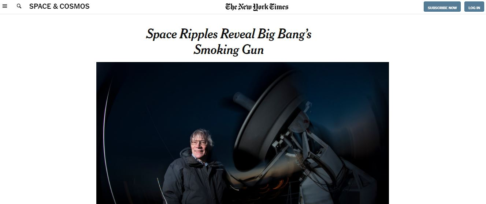

# Project Name

New York Times Articles Page Clone

This project is a clone of New York Times articles section.

## Built With

- HTML,CSS
- Frameworks
- linters

## Live Demo

[Live Demo Link](https://ashakae.github.io/NY-Times-article/)

## Getting Started

**This is an example of how you may give instructions on setting up your project locally.**
**Modify this file to match your project, remove sections that don't apply. For example: delete the testing section if the currect project doesn't require testing.**

To get a local copy up and running follow these simple example steps.

### Prerequisites

### Setup

### Install

### Usage

### Run tests

### Deployment

## Authors

👤 **Author1**

- GitHub: [@AshakaE](https://github.com/AshakaE)

👤 **Author2**

- GitHub: [@SamArsanios](https://github.com/SamArsanios)

## 🤝 Contributing

Contributions, issues, and feature requests are welcome!

Feel free to check the [issues page](issues/).

## Show your support

Give a ⭐️ if you like this project!

## Acknowledgments

- Hat tip to anyone whose code was used
- Inspiration
- etc

## 📝 License

This project is a test project
